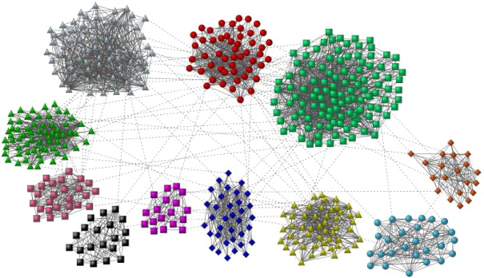

# Projet

## Introduction

**Problématique:** Essayer de prédire les écoutes d'utilisateurs en fonction des gouts musicaux de leurs amis

### Données:

Nos données provient de la base de donnée du site LastFM, un réseau social et une platforme de streaming de musique.

Nous possédont:
- la liste des liens d'amitié entre les utilisateurs
- le nombre d'écoute des utilisateurs par artiste
- une description des artistes

### methodologie:

  Nous n'utiliserons que les liens d'amitiés entre les utilisateurs et leur écoutes pour pédire les écoutes des utilisateurs.
  
  Nous allons dans un premier temps exploiter une proprieté des graph de réseaux sociaux, qui est leur structure communautaire. La plupart des graphs de réseau sociaux se divisent en communauté, groupe de noeuds fortement connectés entre eux, mais faiblement connectés vers les autres communautés:



  Nous allons donc déterminer quelles sont les communautés de notre graph d'amitiées entre les utilisateurs. Une fois ces communautés déterminées, nous allons calculer quelles sont leurs écoutes moyennes, et se servir de ces écoutes pour prédire les écoutes de leurs individus.


## importation des modules

```{r}
library(igraph)
library(dbscan)
library(Matrix)
```


## importation des données

```{r}
artists <- read.delim('./data/artists.dat', header=TRUE, sep="\t")
tags <- read.delim('./data/tags.dat', header=TRUE, sep="\t")
user_artists <- read.delim('./data/user_artists.dat', header=TRUE, sep="\t")
user_friends <- read.delim('./data/user_friends.dat', header=TRUE, sep="\t")
user_tagged_artists_timestamps <- read.delim('./data/user_taggedartists-timestamps.dat', header=TRUE, sep="\t")
user_tagged_artists <- read.delim('./data/user_taggedartists.dat', header=TRUE, sep="\t")
```

exemple de la matrice des relations entre utilisateurs
```{r}
head(user_friends)
```
Construction de la matrice d'adjacence
```{r}
user_graph <- graph_from_edgelist(as.matrix(user_friends), directed=FALSE)
user_adj.sparse <- get.adjacency(user_graph)
rownames(user_adj.sparse) <- paste('u', 1:nrow(user_adj.sparse), sep='')
colnames(user_adj.sparse) <- paste('u', 1:nrow(user_adj.sparse), sep='')
as.data.frame(as.matrix(user_adj.sparse[0:5,270:280]))

```
## Création des communautées

On utilise l'algorythme de Girvan-Newman. Cet algorithme n'est pas adapté pour de grand graph. Nous allons donc essayer de quantifier le temps nécessaire à la construction de communautées 
```{r}
library(parallel)

nb_edge_test <- 2000
step = nb_edge_test / 20
plot(seq(1, nb_edge_test, by=step), mclapply(seq(1, nb_edge_test, by=step), function(i){
  time_start <- Sys.time()
  user_graph.reduce <- graph_from_edgelist(as.matrix(user_friends[1:i,]), directed=FALSE)

  cl_edge_betweenness.reduce <- cluster_edge_betweenness(user_graph.reduce, directed = FALSE)
  return(Sys.time() - time_start)
}, mc.cores = detectCores()), ylab = "temps (seconde)", xlab = "nombre d'arrete")

user_graph.reduce <- graph_from_edgelist(as.matrix(user_friends[1:nb_edge_test,]), directed=FALSE)
```
On peut voir que cet algorithme ne fonctionnera pas efficassement pour tout les noeuds. Il est de complexité au moins polynomiale et nous n'avons pas reussi à le faire tourner en une nuit complête

Nous allons nous pencher sur deux autres approches, une approche gloutone qui se basse aussi sur la modularité (méthode de louvain, développée en 2008), et une approche qui se base sur l'optimisation de la "map equation" (infomap, développé en 2016) 
```{r}
# cl_edge_betweenness.reduce <- cluster_edge_betweenness(user_graph.reduce, directed = FALSE)
# plot(user_graph, vertex.color=rainbow(3, alpha=0.6)[cl_edge_betweenness.reduce$membership])
# 
cl_louvain <- cluster_louvain(user_graph)
# plot(user_graph, vertex.color=rainbow(3, alpha=0.6)[cl_louvain$membership])
# 
cl_infomap <- cluster_infomap(user_graph)
# plot(user_graph, vertex.color=rainbow(3, alpha=0.6)[cl_infomap$membership])
```
les communautés sont des listes dont les valeurs correspondes au l'indice du cluster et dont les id correspondes au l'indice de l'utilisteur en question:
```{r}
head(as.data.frame(cl_infomap$membership))
```

test du nombre de communautée
```{r}
max(cl_louvain$membership)
max(cl_infomap$membership)
```
Nous allons explorer nos communautés, pour tenter de déterminer si le clustering a été efficase.
```{r}
get_freq_list <- function (cl, print = TRUE) {
  freq_cl <- unlist(lapply(1:max(cl$membership), function (i) {
  length(which(cl$membership == i))
}))
  if(print) {
    plot(as.integer(1:length(freq_cl)), freq_cl[order(freq_cl, decreasing = TRUE)], ylab = "taille des communautées", xlab = "communautées")
  }
  return(data.frame(frequence = freq_cl, id_communaute = as.integer(1:length(freq_cl))))
}
```
```{r}
freq_cl_louvain <- get_freq_list(cl_louvain)
```
On peut voir que l'algorithme donne de mauvais résultats, trop de communautés sont composées d'une personne, et il existe des communauté de 500, 300, et 200 personnes.

```{r}
freq_cl_infomap <- get_freq_list(cl_infomap)
```
On peut voir que c'est bien meilleur selon l'algorithme infomap, les communautés sont bien mieux réparties, et la plus grande communauté est composée de 15 élements


Cependant, Plus de 3 quarts des communautés sont composée de 1 a 2 elements par communauté. Pour comprendre pourquoi, nous allons devoir nettoyer un peu nos données

```{r}
nb_friend_by_column <- apply(user_adj.sparse, 2, sum)
plot(1:length(nb_friend_by_column), nb_friend_by_column[order(nb_friend_by_column, decreasing = TRUE)], ylab = "nombre d'amis", xlab = 'utilisateur')
```
On peut voir que beaucoup d'utilisateurs ont moins d'un amis. Pour effectuer une bonne analyse de communauté, les utilisateurs doivent avoir un nombre important d'amis. Nous allons donc supprimer les utilisateurs qui ont moins de 5 amis
```{r}
friend_lim <- 5
user_adj.clean <- user_adj.sparse[which(nb_friend_by_column >= friend_lim), which(nb_friend_by_column >= friend_lim)]

nb_friend_by_column.clean <- apply(user_adj.clean, 2, sum)
plot(1:length(nb_friend_by_column.clean), nb_friend_by_column.clean[order(nb_friend_by_column.clean, decreasing = TRUE)], ylab = "nombre d'amis", xlab = 'utilisateur')
```

```{r}
user_graph.clean <- graph_from_adjacency_matrix(user_adj.clean, mode="undirected")

cl_louvain.clean <- cluster_louvain(user_graph.clean)
cl_infomap.clean <- cluster_infomap(user_graph.clean, nb.trials = 20)

freq_cl_louvain.clean <- get_freq_list(cl_louvain.clean)
```
On peut voir que nous avons bel et bien supprimé les communautés composées d'une à deux personne, mais il existe toujours une communauté regroupant plus de 500 personnes. On ne peut pas espérer prédire des gout musicaux avec des communautés aussi grandes.
```{r}
freq_cl_infomap.clean <- get_freq_list(cl_infomap.clean)
```
On peut voir que l'algorithme infomap donne de bien meilleurs résultats, il n'exite pas de communautés regroupant 500 personnes, et pas ou peu de communauté regroupant une unique personne.

## clustering classique sur la matrice d'adjacence

On essaye avec une méthode qui normalement doit avoir de moins bon résultats avec des matrices aussi sparces que des matrices d'adjacence de cette taille, la méthode k-mean
On utilisera plusieures nombre de clusteur pour préparer la cross-validation
```{r}
results_kmean.clean <- mclapply(seq(50, 500, by=50), function (i) {
  print(i)
  kmeans(user_adj.clean, i)
}, mc.cores = detectCores())
```

Un peu d'analyse de nos clusters:
```{r}
get_freq_list_kmean <- function (cluster_list) {
  lapply(cluster_list, function(cl){
    freq_cl <- unlist(lapply(1:max(cl$cluster), function (i) {
      length(which(cl$cluster == i))0 et 200 personnes, pour laisser à coté enormément de personne dans un unique cluster
    }))
    plot(as.integer(1:length(freq_cl)), freq_cl[order(freq_cl, decreasing = TRUE)], ylab = "taille des communautées", xlab = "communautées")
    return(data.frame(frequence = freq_cl, id_communaute = as.integer(1:length(freq_cl))))
  })
}
```
```{r}
freq_list_kmean.clean = get_freq_list_kmean(results_kmean.clean)
```
On peut voir qu'une fois encore, l'algorithmes k-mean à des difficultées à regouper les personnes en groupe d'amis, avec un groupe enorme oscillant entre 700 et 200 personnes, pour laisser à coté enormément de personne dans un unique cluster

La meilleur approche est donc de reposer sur l'algorithme infomap.

## k-fold cross-validation

Nous avons maintenant nos communautés (memberships en anglais). Une fois ces communautés créées, nous pouvons utiliser une approche par validation croisée, semblable à ce que nous faisions pour l'algorithme knn pour prédire leurs écoutes.

### Matrices user-item

On va dans un premier temps créer une matrice User-items avec comme poids (ou note) le temps d'écoute de chaque utilisteur pour chaque artiste, décris dans la data.frame user_artists
```{r}
head(user_artists)
```
```{r}
user_artists.sparse <- sparseMatrix(
  i = as.integer(user_artists$userID),
  j = as.integer(user_artists$artistID),
  x = as.integer(user_artists$weight),
  dimnames = list(levels(user_artists$userID), levels(user_artists$artistID))
)
rownames(user_artists.sparse) <- paste('u', 1:nrow(user_artists.sparse), sep='')

user_artists.clean <- user_artists.sparse[which(nb_friend_by_column >= friend_lim),]
head(user_artists.clean[0:10,45:55])
```


### Prédiction de l'écoute d'un utilisateur 

On va maintenant essayer de recommander n artistes à un utilisateur
On se base sur les amis de sa communautée, à la manière d'un alogithme knn

On part du principe que l'on connait le graph des amis, et voir si on peut prédire les temps d'écoute d'un utilisateur à partir de sa communautée.
Nous allons donc faire une validation croisée de type leave-one-out, en essayant de prédire le temps d'écoute de chaque utilisateur:

- On regarde pour un utilisteur donné quelle est sa communautée:
```{r}
get_community_index <- function (cluster){
  user_communaute.clean <- data.frame(id_user = 1:length(cluster$membership), id_communaute = cluster$membership)
  return(unstack(user_communaute.clean))
}
communaute.clean <- get_community_index(cl_infomap.clean)
head(communaute.clean)
```

On la selectionne en prenant soit de retirer l'utilisateur en question
```{r}
get_community <- function(user_index, cluster, communaute) {
  communaute.i <- toString(cluster$membership[user_index])
  community_vect <- communaute[[communaute.i]]
  return(community_vect[community_vect != user_index])
}
user_name <- 'u6'
user_index <- match(user_name, rownames(user_artists.clean))
community.i <- get_community(user_index, cl_infomap.clean, communaute.clean)
community.i
```

- On calcule la moyenne des écoutes de cette communauté moins l'utilisateur visé.
```{r}
get_mean_by_user <- function(users, user_artists, threshold = 0) {
  community_artists <- user_artists[users, ]
  community_artists[community_artists <= threshold] <- NA
  return(if(is.null(dim(community_artists))) community_artists else colMeans(community_artists, na.rm = TRUE))
}

data.frame(u1 = user_artists.clean[community.i[1],],
           u2 = user_artists.clean[community.i[2],],
           u3 = user_artists.clean[community.i[3],],
           mean = get_mean_by_user(community.i, user_artists.clean))

```

- On calcule pour l'utilisateur testé la RMSE de ses temps d'écoute et de celle de sa communautée
> Ici, nous ne comptons que les temps d'écoute d'artiste en commun entre l'utilisateur et sa communauté

```{r}
get_RMSE <- function (vect1, vect2) {
  vect1[vect1 == 0] <- NA
  vect2[vect2 == 0] <- NA
  return( sqrt( sum((vect1 - vect2)^2, na.rm = TRUE) / length(vect1[!is.na(vect1) & !is.na(vect2)]) ))
}

# mean_users <- get_mean_by_user(community.u6, user_artists.clean)
# user <- user_artists.clean[user_index,]
# mean_users[mean_users == 0] <- NA
# user[user == 0] <- NA
# sum((mean_users - user)^2, na.rm = TRUE)
# length(mean_users[!is.na(mean_users) & !is.na(user)])
# sum((mean_users - user)^2, na.rm = TRUE) / length(mean_users[!is.na(mean_users) & !is.na(user)])
# sqrt(sum((mean_users - user)^2, na.rm = TRUE) / length(mean_users[!is.na(mean_users) & !is.na(user)]))

get_RMSE(get_mean_by_user(community.i, user_artists.clean),  user_artists.clean[user_index,])

```

Sans connaitre aucune des écoutes de l'utilisateur pour effectuer nos prédictions, On prédits à quel point il écoute certains artistes à 848 ecoutes d'erreur en moyenne.

On peut ce demander si ce chiffre important n'est pas généré par les artistes les plus faiblements écoutés, et que si des artistes les plus écoutés dans un groupe le seront aussi pour un utilisateur en particulier. Pour vérifier cela, nous allons retirer tout les artistes ayant été écouté moins de 500 fois.
```{r}
get_RMSE(get_mean_by_user(community.i, user_artists.clean, 500),
         user_artists.clean[user_index,])
```

Cela fait augmenter la moyenne des erreurs. On peut supposer que le fait que certaines personnes n'écoutent pas ou peu certains artistes est un bon indicateur du fait qu'elles n'apprécient pas ces artistes. Nous attendrons de tester cette méthode sur tout les utilisateurs pour en être sur.

### Prédiction de l'écoute de tout les utilisateurs

On teste cette méthode sur tous les utilisateurs:
```{r}
result <- unlist(lapply(1:dim(user_artists.clean)[1], function (user_index) {
  community <- get_community(user_index, cl_infomap.clean, communaute.clean)
  return(get_RMSE(get_mean_by_user(community, user_artists.clean, 0),
         user_artists.clean[user_index,]))
}))
```
```{r}
mean(result, na.rm = TRUE)
```
On peut voir que pour l'ensemble de utilisateurs, on estime se trompé pour un artiste d'environ 5308 écoutes. La prédiction est donc médiocre.

On peut essayer de voir si ce chiffre serait meilleur en retirant les artistes écoutés très peu par la communautée.
Toutes les écoutes d'un artiste en deça de 100 écoutes, ne seront pas prisent en compte dans le calcul de moyenne:
```{r}
result <- unlist(lapply(1:dim(user_artists.clean)[1], function (user_index) {
  community <- get_community(user_index, cl_infomap.clean, communaute.clean)
  return(get_RMSE(get_mean_by_user(community, user_artists.clean, 100),
         user_artists.clean[user_index,]))
}))
```
```{r}
mean(result, na.rm = TRUE)
```
Cela fait encore une fois augmenter la moyenne des erreurs.

Pour donner sens à la valeur de RMSE moyenne, nous allons voir quelle sont les temps d'écoute moyens des utilisateurs. Nous allons determiner pour chaque utilisateur le temps d'écoute en pourcentage que nous ne somme parvenu a prédire.
```{r}
user_artists.clean[user_artists.clean == 0] <- NA
mean_listening_by_user <- rowMeans(user_artists.clean, na.rm = TRUE)
(mean(result / mean_listening_by_user, na.rm = TRUE)) * 100
```
On peut voir que l'on se trompe d'environ 1224 %. Le problème avec les pourcentage est que si l'erreur est importante pour un utilisateur qui écoute très peu, alors l'erreur en pourcentage sera très grande.

On peut essayer de re-centrer notre étude non seulement aux personnes ayant plus de n amis, mais aussi aux personnes ayant de x minutes d'écoutes.
```{r}
mean_listening_by_user <- rowMeans(user_artists.clean, na.rm = TRUE)
(mean(result[mean_listening_by_user >= 10] / mean_listening_by_user[mean_listening_by_user >= 10], na.rm = TRUE)) * 100
```
```{r}
data.frame(result = as.integer(result[mean_listening_by_user >= 10 & !is.nan(mean_listening_by_user)]), mean_by_user = as.integer(mean_listening_by_user[mean_listening_by_user >= 10 & !is.nan(mean_listening_by_user)] * 100))
```

On peut se demander quelles seraient les bonnes valeures des deux hyper-parametres, nombre d'amis minimum, et nombre d'écoute minimum, donnent les meilleurs

- on va récapituler notre pipeline de transformation de donnée dans une fonction:
```{r}
seq_friend_lim <- seq(3, 21, by=3)
seq_listening_limit <- seq(0, 1000, by=100)

# seq_friend_lim <- seq(3, 6, by=3)
# seq_listening_limit <- seq(0, 100, by=100)

result_lists <- mclapply(seq_friend_lim, function(friend_lim) {
  
  user_adj.clean <- user_adj.sparse[which(nb_friend_by_column >= friend_lim), which(nb_friend_by_column >= friend_lim)]

  user_graph.clean <- graph_from_adjacency_matrix(user_adj.clean, mode="undirected")

  cl_louvain.clean <- cluster_louvain(user_graph.clean)
  cl_infomap.clean <- cluster_infomap(user_graph.clean, nb.trials = 20)

  freq_cl_louvain.clean <- get_freq_list(cl_louvain.clean, FALSE)

  nb_friend_by_column <- apply(user_adj.sparse, 2, sum)
  user_artists.clean <- user_artists.sparse[which(nb_friend_by_column >= friend_lim),]

  communaute.clean <- get_community_index(cl_infomap.clean)
  return(lapply(seq_listening_limit, function(listening_limit) {
    result <- unlist(lapply(1:dim(user_artists.clean)[1], function (user_index) {
      community <- get_community(user_index, cl_infomap.clean, communaute.clean)
      return(get_RMSE(get_mean_by_user(community, user_artists.clean, listening_limit),
           user_artists.clean[user_index,]))
    }))

    user_artists.clean[user_artists.clean == 0] <- NA
    mean_listening_by_user <- rowMeans(user_artists.clean, na.rm = TRUE)
    return((mean(result / mean_listening_by_user, na.rm = TRUE)) * 100)
  }))
}, mc.cores = detectCores())
```

- on afffiche les résultats 
```{r}
library("plot3D")
library(data.table)

result_matrix <- rbindlist(result_lists)
rownames(result_matrix) <- as.character(seq_friend_lim)
colnames(result_matrix) <- as.character(seq_listening_limit)
melted_matrix <- melt(as.matrix(result_matrix))
```
```{r}
scatter3D(melted_matrix$Var1, melted_matrix$Var2, melted_matrix$value, bty = "g", pch = 18, ticktype = "detailed",
          xlab = "friend limit", ylab ="listening limit", zlab = "% error",
          theta = -45, phi = 30)
```
```{r}
persp(z = as.matrix(result_matrix), xlab = "friend limit", ylab ="listening limit", zlab = "% error", theta = -40, phi = 30)
```
On peut voir que les meilleurs résultats sont obtenus pour un nombre d'amis minimum de 15, et d'une limite de listening de 0. Le problème est que la pente est croissante selon la limite d'écoute minimal. Cela veut dire qu'au plus les utilisateurs écoutent de la musique, au plus ils utilisent le service de réseau social, au plus nous avons du mal à prédire les écoutes des utilisateurs. 

Cela peut être expliqué par deux facteurs:
- la clusterisation est mauvaise, les communauté ne sont pas représentatives des réelles communautées ou le graph possède une structure non classique d'un réseau social
- la clusterisation est bonne, mais ce sont les communauté qui sont hétérogènes en goux musicaux.

## Prédiction s'appuyant sur les amis directs

Nous allons maintenant tenter de vérifier les deux hypothèses, en vérifiant si un algorithme knn permet de faire de bonne prédiction, en s'appuyant sur les amis d'un utilisateur. Si cela est la cas, cela veut dire que la clusterisation par communauté n'est pas appropriée à ce dataset.
Pour cette nouvelle approche, nous nous basons sur le modèle KNN (k nearest neighbours).


### Quelques fonctions utiles

On réimport les fonctions de base de similarité consinus et de selection d'un maximum/minimum
```{r}
max.nindex <- function(m, n=5) {
  i <- order(m, decreasing=TRUE)
  return(i[1:n])
}
min.nindex <- function(m, n=5) {
  i <- order(m)
  return(i[1:n])
}

cosinus.vm <- function(v,m) { n <- sqrt(rowSums(m^2)); (m %*% v)/(n * sqrt(sum(v^2))) }

dist_eucl.vm <- function(v,m) { sqrt(rowSums((m - v)^2)) }

cor.vm <- function(v, m) {
  apply(m, 1, cor, y=v)
}
```

On redéfini les matrices de bases
```{r}
ToMatrix <- function(data,m,values){
  for (i in 1:dim(data)[1]){
    if (values){
      m[toString(data[i,1]),toString(data[i,2])] <- data[i,3]
    }else{
      m[toString(data[i,1]),toString(data[i,2])] <- 1
    }
  }
  return(as(m, "sparseMatrix"))
}

n_users <- 1892
n_artists <- 17632
indexes_users <- unique(user_friends[,1])
indexes_artists <- unique(user_artists[,2])

user_adj.sparse <- matrix(0,n_users,n_users)
rownames(user_adj.sparse) <- indexes_users
colnames(user_adj.sparse) <- indexes_users
user_adj.sparse <- ToMatrix(user_friends,user_adj.sparse,FALSE)

user_artists.sparse <- matrix(0,n_users,n_artists)
rownames(user_artists.sparse) <- indexes_users
colnames(user_artists.sparse) <- indexes_artists
user_artists.sparse <- ToMatrix(user_artists,user_artists.sparse,TRUE)
```


### Fonction retournant au minimum les k plus proches *amis* de l’utilisateur user_index ansi que leurs poids

On cherche ici à récupérer tous les amis de l'utilisateur et à leur donner un poids en fonction de leur similarité à l'utilisateur visé. 
Une première modification au modèle KNN est qu'on ne va pas se limiter à un nombre fixe de voisins par utilisateurs : les voisins d'un utilisateur seront représentés par l'entièreté de ses amis. 
Cela dit, si un utilisateur possède moins de *k* amis (paramètre de la fonction), on rajoute à cet utilisateur le nombre de voisins nécessaires pour atteindre les *k* minimum requis. Pour cela, on recherche parmis tous les autres utilisateurs ceux dont le vecteur d'amitié (= ligne de la matrice *user_adj.sparse*) est le plus proche du vecteur d'amitié du dit utilisateur via une similarité cosinus).
Finalement, le poids associé à chaque voisin sera égal à la similarité cosinus des vecteurs d'amitiés des deux utilisateurs auquel on rajoute une certaine constante. Pour les voisins qui sont des amis directs, cette constante vaut *alpha* (paramètre de la fonction), pour les autres elle vaut 0. Cela permet d'éviter les poids nuls et de mettre plus d'importance aux *vrais* amis.
```{r}
Closest_friends <- function(user_index,k,alpha){
  user <- user_adj.sparse[user_index,]
  friends_id <- colnames(user_adj.sparse)[user!=0]
  n_rest_friends <- k - sum(user)
  n_friends <- min(k,sum(user))
  if (n_rest_friends <= 0){
    close_friends_id <- friends_id
  }else{
    others_id <- colnames(user_adj.sparse)[user==0]
    sim <- cosinus.vm(user,user_adj.sparse[others_id,])
    close_users <- others_id[max.nindex(sim,n_rest_friends+1)]
    close_friends_id <- c(friends_id,close_users[1:n_rest_friends+1])
  }
  close_friends <- user_adj.sparse[close_friends_id,]
  weights <- cosinus.vm(user,close_friends)
  weights[1:n_friends] <- weights[1:n_friends] + alpha
  return(t(weights))
}
```

Exemple pour l'utilisateur '2':
```{r}
as.data.frame(as.matrix(Closest_friends('2', 5,0)))
```


## Fonction recommandant n artistes à l'utilisateur *user_index*

Cette fonction recommande *n* artistes à l'utilisateur *user_index* en se basant sur un algorithme KNN modifié : 
  - Les voisins de l'utilisateur concerné ainsi que leurs poids sont retournés par la fonction *Closest_friends(user_index,k,alpha)*
  - On calcule par la suite une valeur de recommandation pour chaque artiste : plus cette valeur est élevée, plus l'artsite a de chance d'être recommandé
  - Pour un artiste *j* et un utilisateur *i*, Cette valeur se calcule ainsi : $\sum_{k \in voisins} \frac{user_artists.sparse_{k,j}}{moyenne(k)} * poids(k) 
  - La fonction renvoie finalement les *n* artistes ayant les plus hautes valeurs

```{r}
KNN <- function(user_index,n,k,alpha){
  weights <- Closest_friends(user_index,k,alpha)
  neighbors_id <- colnames(weights)
  neighbors <- user_artists.sparse[neighbors_id,]
  neighbors[neighbors == 0] <- NA
  mean_neighbors <- rowMeans(neighbors, na.rm = TRUE)
  values_neighbors <- weights %*% (user_artists.sparse[neighbors_id,]/mean_neighbors)
  return(colnames(user_artists.sparse)[max.nindex(values_neighbors,n)])
}
```

exemplede recommandation pour l'utilisateur 2:
```{r}
KNN('2',10,10,0)
```

Il est important de noter que la plupart des choix de modélisations de cet algorithme (le nombre et la nature des voisins, le calcul des poids, la division par la moyenne, ...) ont été choisi suites à différents tests car ils donnaient de meilleurs résultats à l'évaluation.

## Evalutaion de l'algorithme

Nous allons maintenant voir si pour un utilisateur donné, on peut espérer recommander des artistes qu'il écoute.

Nous avons choisi d'évaluer notre méthode selon 2 métriques : 
  - le *recall* est la proportion d'artistes recommandés qui étaient effectivement écoutés par l'utilisateur sur l'ensemble des artistes écoutés par celui-ci 
  _ le *listening ratio* qui est le ratio entre la somme du temps d'écoute de l'utilisateur pour tous les artistes recommandés et le temps d'écoute total de l'utilisateur

Pour cela nous avons créé une fonction retournant différentes informations sur les recommandations faites pour un utilisateur en particulier (*user_index*), pour un nombre de recommandations défini (*n_recom*) et selon les hyper-paramètres *k* et *alpha*.
Voici ces différentes informations :
  - *recom_number* = le nombre d'artistes recommandés qui étaient effectivement écoutés par l'utilisateur
  - *recom_value* = la somme du temps d'écoute de l'utilisateur pour tous les artistes recommandés
  - *n* = le nombre d'artistes écoutés par l'utilisateur
  - *tot_value* = le temps d'écoute total de l'utilisateur (pour tous les artistes)
  - *time* = le temps pris par l'algorithme pour faire les recommandations
  
```{r}
evaluate <- function(user_index,k,alpha,n_recom){
  user <- user_artists.sparse[user_index,]
  tot_value <- sum(user)
  n <- length(user[user>0])
  music <- colnames(user_artists.sparse)[user>0]
  t1 <- Sys.time()
  recommandations <- KNN(user_index, n_recom, k, alpha)
  time <- Sys.time() - t1
  recom_number <- length(intersect(music,recommandations))
  recom_value <- sum(user[recommandations])
  return(c(recom_number,recom_value,n,tot_value,time))
}
```
exemple pour l'utilisateur 2:
```{r}
data.frame(metric = c('nombre de bonnes recommandations', 'nombre d\'écoutes de l\'utilisateur pour les artistes recommandés ', 'nombre d\'artistes écoutés', 'nombre total d\'écoutes', 'temps'),
           value = as.integer(evaluate('2', 10,0,10)))
```


Finalement, nous voulions évaluer notre méthode sur tous les utilisateurs afin d'obtenir des valeurs moyennes.
Dans cette fonction, *k*, *alpha* et *n_recom* sont les hyper-paramètres utilisés pour la recommandation et *min_friend* est un entier désignant le nombre minimum d'amis requis par utilisateur pour être évaluer. En effet, étant donné que notre modèle se base principalement sur l'amitié, les utilisateurs ne possédant que très peu d'amis pouvaient influencer négativement les résultats. C'est pourquoi nous n'évaluons que les utilisateurs possédant minimum *min_friend* amis.

Nous avons donc évaluer chaque métrique (*recall* et *listening ratio*) de deux manières différentes : 
  - *macro* : on prend la moyenne des métriques de chaque utilisateur  
  - *micro* : au lieu de calculer les métriques selon chaque utilisateur, on les calcule sur toute la matrice

Cette fonction retourne un vecteur contenant ces différentes informations (dans l'ordre):
  - *n_user_tested* = le nombre d'utilisateurs évalués
  - le nombre total de recommandations effectuées (= *n_user_tested* * *n_recom*)
  - *micro_recall* = la précision *micro*
  - *macro_recall* = la précision *macro*
  - *micro_listeningRatio* = le listening ratio *micro*
  - *macro_listeningRatio* = le listening ratio*micro*
  - *time* = le temps moyen pris par l'algorithme pour faire les recommandations sur un utilisateur

```{r}
evaluateAll <- function(k,alpha,min_friend,n_recom,display=FALSE){
  micro_recall <- 0
  macro_recall <- 0
  micro_listeningRatio <- 0
  macro_listeningRatio <- 0
  tot_listeningCount <- 0
  tot_n <- 0
  n_notEvaluated <- 0
  time <- 0
  for (user in indexes_users){
    if(sum(user_adj.sparse[toString(user),]) < min_friend){
      n_notEvaluated <- n_notEvaluated + 1
    }else{
      result <- evaluate(toString(user),k,alpha,n_recom)
      time <- time + result[5]
      micro_recall <- micro_recall + result[1]
      macro_recall <- macro_recall + result[1]/result[3]
      tot_n <- tot_n + result[3]
      micro_listeningRatio <- micro_listeningRatio + result[2]
      macro_listeningRatio <- macro_listeningRatio + result[2]/result[4]
      tot_listeningCount<- tot_listeningCount + result[4]
    }
  }
  n_users_tested <- n_users - n_notEvaluated
  micro_recall <- micro_recall / tot_n
  macro_recall <- macro_recall / n_users_tested
  micro_listeningRatio <- micro_listeningRatio / tot_listeningCount
  macro_listeningRatio <- macro_listeningRatio / n_users_tested
  time <- time / n_users_tested
  if (display){
    df_display <- data.frame(Nbers_users_tested = n_users_tested,
                             Nbers_predictions = n_recom * n_users_tested,
                             Mean_time_by_user = time,
                             Micro_recall = micro_recall,
                             Macro_recall = macro_recall,
                             Micro_Listening_Ratio = micro_listeningRatio,
                             Macro_Listening_Ratio = macro_listeningRatio)
    print(df_display)
  }
  return(c(n_users_tested, n_recom*n_users_tested, micro_recall, macro_recall, micro_listeningRatio, macro_listeningRatio,time))
}

```
Exemple pour 40 voisins minimum, 50 recommandations par utilisateur et un minimum d'amis de 5 : 
```{r}
result <-   evaluateAll(40,0.5,5,50,display=TRUE)
```

Un premier point important à noter est que la valeur *listening ratio* est nettement plus élevé que la valeur de recall. Cela implique que les artistes justement recommandés par le modèle sont ceux qui ont un temps d'écoute élevé ! 
En effet, pour 50 recommandations (qui est le nombre moyen d'artistes écoutés par utilisateur) seulement 30% des artistes réellement écouté par les utilisateurs ont été recommandé mais ces artistes représentent presque 60% du temps d'écoute des utilisateurs. 

### Evaluation d'une méthode aléatoire

Afin de comparer notre méthode avec une autre méthode arbitraire, nous évaluons les mêmes métriques que précédemment mais à la place d'utiliser l'algorithme décrit plus haut pour les recommandations, nous recommandons *n_recom* artistes aléatoires pour chaque utilisateur.

```{r}
randomEvaluateAll <- function(n_recom,display=FALSE){
  micro_recall <- 0
  macro_recall <- 0
  micro_listeningRatio <- 0
  macro_listeningRatio <- 0
  tot_listeningCount <- 0
  tot_n <- 0
  for (user in indexes_users){
    user <- user_artists.sparse[toString(user),]
    n <- length(user[user>0])
    music <- colnames(user_artists.sparse)[user>0]
    random_pred <- colnames(user_artists.sparse)[sample(1:n_artists,n_recom)]
    true <- length(intersect(music,random_pred))
    listeningCount <- sum(user[random_pred])
    micro_recall <- micro_recall + true
    macro_recall <- macro_recall + true / n
    tot_n <- tot_n + n
    micro_listeningRatio <- micro_listeningRatio + listeningCount
    macro_listeningRatio <- macro_listeningRatio + listeningCount / sum(user)
    tot_listeningCount<- tot_listeningCount + sum(user)
  }
  micro_recall <- micro_recall / tot_n
  macro_recall <- macro_recall / n_users
  micro_listeningRatio <- micro_listeningRatio / tot_listeningCount
  macro_listeningRatio <- macro_listeningRatio / n_users
  if (display){
    df_display <- data.frame(Nbers_users_tested = n_users,
                             Nbers_predictions = n_recom * n_users,
                             Micro_recall = micro_recall,
                             Macro_recall = macro_recall,
                             Micro_Listening_Ratio = micro_listeningRatio,
                             Macro_Listening_Ratio = macro_listeningRatio)
    print(df_display)
  }
}
randomEvaluateAll(50,display=TRUE)
```


On peut donc remarquer que le modèle basé sur l'amitié est un modèle cohérent qui donne des résultats bien meilleurs qu'une recommandation aléatoire.


Nous allons maintenant essayer plusieurs valeurs d'hyper-paramètres :

### Variation du nombre minimum de voisins (k)

En premier nous faisons varier le nombre de voisins minimum :
```{r}
library(parallel)
min_k <- c(5,10,20,30,40,50,60)
recall_k <- matrix(0,7,2)
listeningRatio_k <- matrix(0,7,2)
time_k <- 1:7

for (i in 1:7) {
    result <- evaluateAll(min_k[i],0.5,6,50)
    recall_k[i,1] <- result[3]
    recall_k[i,2] <- result[4]
    listeningRatio_k[i,1] <- result[5]
    listeningRatio_k[i,2] <- result[6]
    time_k[i] <- result[7]
}
```

```{r}
matplot(min_k,listeningRatio_k, ylab = "Listening ratio", xlab = "minimum number of neighbors", type = 'l', col = 1:2)
legend("topleft",legend = c('micro', 'macro'), col = 1:2, pch = 1)

matplot(min_k,recall_k, ylab = "Recall", xlab = "minimum number of neighbors", type = 'l', col = 1:2)
legend("topleft",legend = c('micro', 'macro'), col = 1:2, pch = 1)

plot(min_k,time_k, ylab = "Mean time to recommend a user (in secs)", xlab = "minimum number of neighbors", type = 'l')
```
On remarque donc que plus le nombre de voisins est grand plus notre algorithme est précis. Cela dit, pour plus de 40 voisins minimum, le recall et le *listening ratio* n'augmentent que très peu significativement alors que le temps requis pour recommander un utilisateur lui, croît presque linéairement. 
On peut donc conclure qu'un bon compromis entre le temps d'exécution et la qualité des recommandations est d'avoir entre 20 et 40 voisins minimum par utilisateur.

### Variation du paramètre *alpha*

Ensuite nous avons fait varier le paramètre *alpha* deux fois : une fois avec 20 et une fois avec 40 voisins minimum afin d'étudier l'impact du paramètre *alpha* selon différents nombres de voisins minimum.
```{r}
alpha <- c(0,0.1,0.3,0.5,0.8,1,2)
recall_alpha_k20 <- matrix(0,7,2)
listeningRatio_alpha_k20 <- matrix(0,7,2)
time_alpha_k20 <- 1:7

for (i in 1:7) {
    result <- evaluateAll(20,alpha[i],6,50)
    recall_alpha_k20[i,1] <- result[3]
    recall_alpha_k20[i,2] <- result[4]
    listeningRatio_alpha_k20[i,1] <- result[5]
    listeningRatio_alpha_k20[i,2] <- result[6]
    time_alpha_k20[i] <- result[7]
}


recall_alpha_k40 <- matrix(0,7,2)
listeningRatio_alpha_k40 <- matrix(0,7,2)
time_alpha_k40 <- 1:7

for (i in 1:7) {
    result <- evaluateAll(40,alpha[i],6,50)
    recall_alpha_k40[i,1] <- result[3]
    recall_alpha_k40[i,2] <- result[4]
    listeningRatio_alpha_k40[i,1] <- result[5]
    listeningRatio_alpha_k40[i,2] <- result[6]
    time_alpha_k40[i] <- result[7]
}
```

```{r}
matplot(alpha,t(rbind(t(listeningRatio_alpha_k20),t(listeningRatio_alpha_k40))), ylab = "Listening ratio", xlab = "alpha", type = 'l', col = 1:4)
legend("left",legend = c('micro k= 20', 'macro k=20','micro k= 40', 'macro k=40'), col = 1:4, pch = 1)

matplot(alpha,t(rbind(t(recall_alpha_k20),t(recall_alpha_k40))), ylab = "Recall", xlab = "alpha ", type = 'l', col = 1:2)
legend("bottomright",legend = c('micro k= 20', 'macro k=20','micro k= 40', 'macro k=40'), col = 1:4, pch = 1)

#matplot(alpha,matrix(c(time_alpha_k20,time_alpha_k40),7,2), ylab = "Mean time to recommend a user (in secs)", xlab = #"alpha", type = 'l', col = 1:2)
#legend("topleft",legend = c('k= 20', 'k=40'), col = 1:2, pch = 1)
```
Grâce aux graphes, on peut remarquer que le paramètre *alpha* n'impacte que très peu l'éfficacité des recommandations, quel que soit le nombre de voisins minimum. Cela dit, une valeur de 0.5 pour ce paramètre semble être un bon choix car il maximise à la fois le recall et le *listening ratio*.

### Variation du nombre minimum d'amis requis

Par la suite, nous voulions savoir à quel point le fait qu'un utilisateur ait peu d'amis impactait-il la qualité des recommandations. Pour cela, nous avons évalué plusieurs fois notre système en faisant varier le nombre minimum d'amis requis par un utilisateur pour être recommander:
```{r}
min_friends <- c(1,2,3,5,6,8,10)
recall_min_friends <- matrix(0,7,2)
listeningRatio_min_friends <- matrix(0,7,2)
n_users_tested <- 1:7

for (i in 1:7) {
    result <- evaluateAll(40,0.5,min_friends[i],50) 
    recall_min_friends[i,1] <- result[3]
    recall_min_friends[i,2] <- result[4]
    listeningRatio_min_friends[i,1] <- result[5]
    listeningRatio_min_friends[i,2] <- result[6]
    n_users_tested[i] <- result[1]
}
```


```{r}
matplot(min_friends,listeningRatio_min_friends, ylab = "Listening ratio", xlab = "min number of friends", type = 'l', col = 1:2)
legend("topleft",legend = c('micro', 'macro'), col = 1:2, pch = 1)

matplot(min_friends,recall_min_friends, ylab = "recall", xlab = "min number of friends", type = 'l', col = 1:2)
legend("topleft",legend = c('micro', 'macro'), col = 1:2, pch = 1)

plot(min_friends,n_users_tested, ylab = "Number of recommended users", xlab = "min number of friends", type = 'l')
```
On remarque donc que ce paramètre impacte fortement la qualité des recommandations ! 
Naturellement, notre système dépend fort du nombre d'amis que possède un utilisateur et il recommande assez mal les utilisateurs en ayant peu.
Cela dit, le nombre d'utilisateurs recommandés baisse fort lorsqu'on augmente le nombre minimum d'amis requis.
On peut donc conclure que notre système de recommandation basé sur les liens d'amitié peut être efficace s'il est appliqué sur des utilisateurs ayant de nombreux amis.

### Variation du nombre de recommandations par utilisateur

Finalement, nous avons fait varier le nombre de recommantions par utilisateur. 

Il est important de savoir que le nombre maximum d'artistes écoutés par utilisateur est de 50 mais la moyenne est de 49. Il y a donc une grande majorité des utilisateurs qui écoutent exactement 50 artistes différents. 
Cela implique qu'en dessous de 50 recommandations par utilisateur il est impossible d'atteindre une précision ou un listening ratio de 1.
```{r}
n_pred <- c(5,10,20,30,50,70,100)
recall_pred <- matrix(0,7,2)
listeningRatio_pred <- matrix(0,7,2)
time_pred <- 1:7

for (i in 1:7) {
    result <- evaluateAll(40,0.5,6,n_pred[i]) 
    recall_pred[i,1] <- result[3]
    recall_pred[i,2] <- result[4]
    listeningRatio_pred[i,1] <- result[5]
    listeningRatio_pred[i,2] <- result[6]
    time_pred[i] <- result[7]
}
```

```{r}
matplot(n_pred,listeningRatio_pred, ylab = "Listening ratio", xlab = "number of predictions", type = 'l', col = 1:2)
legend("topleft",legend = c('micro', 'macro'), col = 1:2, pch = 1)

matplot(n_pred,recall_pred, ylab = "recall", xlab = "number of predictions", type = 'l', col = 1:2)
legend("topleft",legend = c('micro', 'macro'), col = 1:2, pch = 1)
```

Naturellement, le recall et le *listening ratio* gonflent lorsque nous agmentons le nombre de prédictions par utilisateur.
On peut remarquer sur le graphe que les pentes du *listening ratio* et du recall sont assez fortes au départ et que la valeur initiale du *micro listening ratio* est de 0.3. Ceci implique que les premiers artistes recommandés par notre système sont presque toujours des artistes fortement écoutés par les utilisateurs.

En conclusion, notre système de recommandation est très efficace pour recommander un petit nombre d'artistes (entre 1 et 10) à des utilisateurs ayant beaucoup d'amis. 


